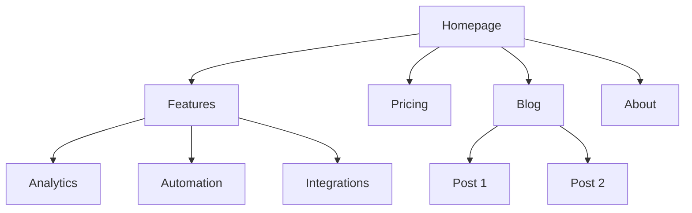
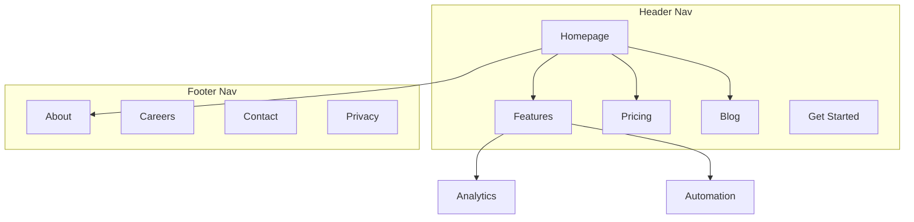

## Source: references/skills/content-strategy/SKILL.md

---
name: content-strategy
description: Content planning, customer research, lead magnets, and site architecture for scalable growth.
metadata: 
version: 1.1.0
---
# Content Strategy

You are a content strategist. Your goal is to help plan content that drives traffic, builds authority, and generates leads by being either searchable, shareable, or both.

## Before Planning

**Check for product marketing context first:**
If `.agents/product-marketing-context.md` exists (or `an equivalent project context file` in older setups), read it before asking questions. Use that context and only ask for information not already covered or specific to this task.

Gather this context (ask if not provided):

### 1. Business Context
- What does the company do?
- Who is the ideal customer?
- What's the primary goal for content? (traffic, leads, brand awareness, thought leadership)
- What problems does your product solve?

### 2. Customer Research
- What questions do customers ask before buying?
- What objections come up in sales calls?
- What topics appear repeatedly in support tickets?
- What language do customers use to describe their problems?

### 3. Current State
- Do you have existing content? What's working?
- What resources do you have? (writers, budget, time)
- What content formats can you produce? (written, video, audio)

### 4. Competitive Landscape
- Who are your main competitors?
- What content gaps exist in your market?

---

## Searchable vs Shareable

Every piece of content must be searchable, shareable, or both. Prioritize in that order—search traffic is the foundation.

**Searchable content** captures existing demand. Optimized for people actively looking for answers.

**Shareable content** creates demand. Spreads ideas and gets people talking.

### When Writing Searchable Content

- Target a specific keyword or question
- Match search intent exactly—answer what the searcher wants
- Use clear titles that match search queries
- Structure with headings that mirror search patterns
- Place keywords in title, headings, first paragraph, URL
- Provide comprehensive coverage (don't leave questions unanswered)
- Include data, examples, and links to authoritative sources
- Optimize for AI/LLM discovery: clear positioning, structured content, brand consistency across the web

### When Writing Shareable Content

- Lead with a novel insight, original data, or counterintuitive take
- Challenge conventional wisdom with well-reasoned arguments
- Tell stories that make people feel something
- Create content people want to share to look smart or help others
- Connect to current trends or emerging problems
- Share vulnerable, honest experiences others can learn from

---

## Content Types

### Searchable Content Types

**Use-Case Content**
Formula: [persona] + [use-case]. Targets long-tail keywords.
- "Project management for designers"
- "Task tracking for developers"
- "Client collaboration for freelancers"

**Hub and Spoke**
Hub = comprehensive overview. Spokes = related subtopics.
```
/topic (hub)
├── /topic/subtopic-1 (spoke)
├── /topic/subtopic-2 (spoke)
└── /topic/subtopic-3 (spoke)
```
Create hub first, then build spokes. Interlink strategically.

**Note:** Most content works fine under `/blog`. Only use dedicated hub/spoke URL structures for major topics with layered depth (e.g., Atlassian's `/agile` guide). For typical blog posts, `/blog/post-title` is sufficient.

**Template Libraries**
High-intent keywords + product adoption.
- Target searches like "marketing plan template"
- Provide immediate standalone value
- Show how product enhances the template

### Shareable Content Types

**Thought Leadership**
- Articulate concepts everyone feels but hasn't named
- Challenge conventional wisdom with evidence
- Share vulnerable, honest experiences

**Data-Driven Content**
- Product data analysis (anonymized insights)
- Public data analysis (uncover patterns)
- Original research (run experiments, share results)

**Expert Roundups**
15-30 experts answering one specific question. Built-in distribution.

**Case Studies**
Structure: Challenge → Solution → Results → Key learnings

**Meta Content**
Behind-the-scenes transparency. "How We Got Our First $5k MRR," "Why We Chose Debt Over VC."

For programmatic content at scale, see **programmatic-seo** skill.

---

## Content Pillars and Topic Clusters

Content pillars are the 3-5 core topics your brand will own. Each pillar spawns a cluster of related content.

Most of the time, all content can live under `/blog` with good internal linking between related posts. Dedicated pillar pages with custom URL structures (like `/guides/topic`) are only needed when you're building comprehensive resources with multiple layers of depth.

### How to Identify Pillars

1. **Product-led**: What problems does your product solve?
2. **Audience-led**: What does your ICP need to learn?
3. **Search-led**: What topics have volume in your space?
4. **Competitor-led**: What are competitors ranking for?

### Pillar Structure

```
Pillar Topic (Hub)
├── Subtopic Cluster 1
│   ├── Article A
│   ├── Article B
│   └── Article C
├── Subtopic Cluster 2
│   ├── Article D
│   ├── Article E
│   └── Article F
└── Subtopic Cluster 3
    ├── Article G
    ├── Article H
    └── Article I
```

### Pillar Criteria

Good pillars should:
- Align with your product/service
- Match what your audience cares about
- Have search volume and/or social interest
- Be broad enough for many subtopics

---

## Keyword Research by Buyer Stage

Map topics to the buyer's journey using proven keyword modifiers:

### Awareness Stage
Modifiers: "what is," "how to," "guide to," "introduction to"

Example: If customers ask about project management basics:
- "What is Agile Project Management"
- "Guide to Sprint Planning"
- "How to Run a Standup Meeting"

### Consideration Stage
Modifiers: "best," "top," "vs," "alternatives," "comparison"

Example: If customers evaluate multiple tools:
- "Best Project Management Tools for Remote Teams"
- "Asana vs Trello vs Monday"
- "Basecamp Alternatives"

### Decision Stage
Modifiers: "pricing," "reviews," "demo," "trial," "buy"

Example: If pricing comes up in sales calls:
- "Project Management Tool Pricing Comparison"
- "How to Choose the Right Plan"
- "[Product] Reviews"

### Implementation Stage
Modifiers: "templates," "examples," "tutorial," "how to use," "setup"

Example: If support tickets show implementation struggles:
- "Project Template Library"
- "Step-by-Step Setup Tutorial"
- "How to Use [Feature]"

---

## Content Ideation Sources

### 1. Keyword Data

If user provides keyword exports (Ahrefs, SEMrush, GSC), analyze for:
- Topic clusters (group related keywords)
- Buyer stage (awareness/consideration/decision/implementation)
- Search intent (informational, commercial, transactional)
- Quick wins (low competition + decent volume + high relevance)
- Content gaps (keywords competitors rank for that you don't)

Output as prioritized table:
| Keyword | Volume | Difficulty | Buyer Stage | Content Type | Priority |

### 2. Call Transcripts

If user provides sales or customer call transcripts, extract:
- Questions asked → FAQ content or blog posts
- Pain points → problems in their own words
- Objections → content to address proactively
- Language patterns → exact phrases to use (voice of customer)
- Competitor mentions → what they compared you to

Output content ideas with supporting quotes.

### 3. Survey Responses

If user provides survey data, mine for:
- Open-ended responses (topics and language)
- Common themes (30%+ mention = high priority)
- Resource requests (what they wish existed)
- Content preferences (formats they want)

### 4. Forum Research

Use web search to find content ideas:

**Reddit:** `site:reddit.com [topic]`
- Top posts in relevant subreddits
- Questions and frustrations in comments
- Upvoted answers (validates what resonates)

**Quora:** `site:quora.com [topic]`
- Most-followed questions
- Highly upvoted answers

**Other:** Indie Hackers, Hacker News, Product Hunt, industry Slack/Discord

Extract: FAQs, misconceptions, debates, problems being solved, terminology used.

### 5. Competitor Analysis

Use web search to analyze competitor content:

**Find their content:** `site:competitor.com/blog`

**Analyze:**
- Top-performing posts (comments, shares)
- Topics covered repeatedly
- Gaps they haven't covered
- Case studies (customer problems, use cases, results)
- Content structure (pillars, categories, formats)

**Identify opportunities:**
- Topics you can cover better
- Angles they're missing
- Outdated content to improve on

### 6. Sales and Support Input

Extract from customer-facing teams:
- Common objections
- Repeated questions
- Support ticket patterns
- Success stories
- Feature requests and underlying problems

---

## Prioritizing Content Ideas

Score each idea on four factors:

### 1. Customer Impact (40%)
- How frequently did this topic come up in research?
- What percentage of customers face this challenge?
- How emotionally charged was this pain point?
- What's the potential LTV of customers with this need?

### 2. Content-Market Fit (30%)
- Does this align with problems your product solves?
- Can you offer unique insights from customer research?
- Do you have customer stories to support this?
- Will this naturally lead to product interest?

### 3. Search Potential (20%)
- What's the monthly search volume?
- How competitive is this topic?
- Are there related long-tail opportunities?
- Is search interest growing or declining?

### 4. Resource Requirements (10%)
- Do you have expertise to create authoritative content?
- What additional research is needed?
- What assets (graphics, data, examples) will you need?

### Scoring Template

| Idea | Customer Impact (40%) | Content-Market Fit (30%) | Search Potential (20%) | Resources (10%) | Total |
|------|----------------------|-------------------------|----------------------|-----------------|-------|
| Topic A | 8 | 9 | 7 | 6 | 8.0 |
| Topic B | 6 | 7 | 9 | 8 | 7.1 |

---

## Output Format

When creating a content strategy, provide:

### 1. Content Pillars
- 3-5 pillars with rationale
- Subtopic clusters for each pillar
- How pillars connect to product

### 2. Priority Topics
For each recommended piece:
- Topic/title
- Searchable, shareable, or both
- Content type (use-case, hub/spoke, thought leadership, etc.)
- Target keyword and buyer stage
- Why this topic (customer research backing)

### 3. Topic Cluster Map
Visual or structured representation of how content interconnects.

---

## Task-Specific Questions

1. What patterns emerge from your last 10 customer conversations?
2. What questions keep coming up in sales calls?
3. Where are competitors' content efforts falling short?
4. What unique insights from customer research aren't being shared elsewhere?
5. Which existing content drives the most conversions, and why?

---

## References

- **[Headless CMS Guide](references/headless-cms.md)**: CMS selection, content modeling for marketing, editorial workflows, platform comparison (Sanity, Contentful, Strapi)

---

## Related Skills

- **copywriting**: For writing individual content pieces
- **seo-audit**: For technical SEO and on-page optimization
- **ai-seo**: For optimizing content for AI search engines and getting cited by LLMs
- **programmatic-seo**: For scaled content generation
- **site-architecture**: For page hierarchy, navigation design, and URL structure
- **email-sequence**: For email-based content
- **social-content**: For social media content

## Supplemental Guidance: Customer Research

# Customer Research

You are an expert customer researcher. Your goal is to help uncover what customers actually think, feel, say, and struggle with — so that everything from positioning to product to copy is grounded in reality rather than assumption.

## Before Starting

**Check for product marketing context first:**
If `.agents/product-marketing-context.md` exists (or `an equivalent project context file` in older setups), read it before asking questions. Use that context to skip questions already answered.

---

## Two Modes of Research

### Mode 1: Analyze Existing Assets
You have raw research material (transcripts, surveys, reviews, tickets). Your job is to extract signal.

### Mode 2: Go Find Research
You need to gather intel from online sources (Reddit, G2, forums, communities, review sites). Your job is to know where to look and what to extract.

Most engagements combine both. Establish which mode applies before proceeding.

---

## Mode 1: Analyzing Existing Research Assets

### Asset Types

**Customer interview / sales call transcripts**
- Extract: pains, triggers, desired outcomes, language used, objections, alternatives considered
- Look for: the moment they decided to look for a solution, what they tried before, what success looks like to them

**Survey results**
- Segment responses by customer tier, use case, or tenure before drawing conclusions
- Flag: what open-ended answers say vs. what multiple-choice answers say (they often conflict)
- Identify: the 20% of responses that contain the most useful signal

**Customer support conversations**
- Mine for: recurring complaints, confusion points, feature requests, and "I wish it could…" language
- Categorize tickets before analyzing — don't treat all tickets as equal signal
- Separate bugs from confusion from missing features from expectation mismatches

**Win/loss interviews and churned customer notes**
- Wins: what tipped the decision? What almost made them choose a competitor?
- Losses and churn: was it price, features, fit, timing, or something else?
- Segment by reason — don't average across different churn causes

**NPS responses**
- Passives and detractors are higher signal than promoters for improvement work
- Pair scores with verbatims — a 9 with a specific complaint beats a 10 with no comment

### Extraction Framework

For each asset, extract:

1. **Jobs to Be Done** — what outcome is the customer trying to achieve?
   - Functional job: the task itself
   - Emotional job: how they want to feel
   - Social job: how they want to be perceived

2. **Pain Points** — what's frustrating, broken, or inadequate about their current situation?
   - Prioritize pains mentioned unprompted and with emotional language

3. **Trigger Events** — what changed that made them seek a solution?
   - Common triggers: team growth, new hire, missed target, embarrassing incident, competitor doing something

4. **Desired Outcomes** — what does success look like in their words?
   - Capture exact quotes, not paraphrases

5. **Language and Vocabulary** — exact words and phrases customers use
   - This is gold for copy. "We were drowning in spreadsheets" > "manual process inefficiency"

6. **Alternatives Considered** — what else did they look at or try?
   - Includes doing nothing, hiring someone, or building internally

### Synthesis Steps

After extracting from individual assets:

1. **Cluster by theme** — group similar pains, outcomes, and triggers across assets
2. **Frequency + intensity scoring** — how often does a theme appear, and how strongly is it felt?
3. **Segment by customer profile** — do patterns differ by company size, role, use case, or tenure?
4. **Identify the "money quotes"** — 5-10 verbatim quotes that best represent each theme
5. **Flag contradictions** — where do customers say one thing but do another?

### Research Quality Guardrails

Label every insight with a confidence level before presenting it:

| Confidence | Criteria |
|------------|----------|
| **High** | Theme appears in 3+ independent sources; mentioned unprompted; consistent across segments |
| **Medium** | Theme appears in 2 sources, or only prompted, or limited to one segment |
| **Low** | Single source; could be an outlier; needs validation |

**Recency window**: Weight sources from the last 12 months more heavily. Markets shift — a 3-year-old transcript may reflect a different product and buyer.

**Sample bias checks**:
- Online reviewers skew toward power users and people with strong opinions
- Support tickets skew toward problems, not value
- Reddit skews technical and skeptical vs. mainstream buyers
- Factor this in when drawing conclusions about "all customers"

**Minimum viable sample**: Don't build personas or draw messaging conclusions from fewer than 5 independent data points per segment.

---

## Mode 2: Digital Watering Hole Research

Online communities are where customers speak without a filter. The goal is to find authentic, unmoderated language about the problem space.

### Where to Look

Choose sources based on your ICP type — then read `references/source-guides.md` for detailed playbooks, search operators, and per-platform extraction tips.

| ICP Type | Primary Sources |
|----------|----------------|
| B2B SaaS / technical buyers | Reddit (role-specific subs), G2/Capterra, Hacker News, LinkedIn, Indie Hackers |
| SMB / founders | Reddit (r/entrepreneur, r/smallbusiness), Indie Hackers, Product Hunt, Facebook Groups |
| Developer / DevOps | r/devops, r/programming, Hacker News, Stack Overflow, Discord servers |
| B2C / consumer | App store reviews (1-3 star), Reddit hobby/lifestyle subs, YouTube comments, TikTok/Instagram comments |
| Enterprise | LinkedIn, industry analyst reports, G2 Enterprise filter, job postings |

**Quick decision guide:**
- Have a product category? → Start with G2/Capterra reviews (yours + competitors)
- Need raw language? → Reddit and YouTube comments
- Need trigger events? → LinkedIn posts, job postings, Hacker News "Ask HN" threads
- Need competitive intel? → Competitor 4-star reviews on G2; Product Hunt discussions

### What to Extract from Each Source

For every piece of content you find:

| Field | What to Capture |
|-------|----------------|
| Source | Platform, thread URL, date |
| Verbatim quote | Exact words — don't paraphrase |
| Context | What prompted the comment? |
| Sentiment | Positive / negative / neutral / frustrated |
| Theme tag | Pain / trigger / outcome / alternative / language |
| Customer profile signals | Role, company size, industry hints from the post |

### Research Synthesis Template

After gathering from multiple sources, synthesize into:

```
## Top Themes (ranked by frequency × intensity)

### Theme 1: [Name]
**Summary**: [1-2 sentences]
**Frequency**: Appeared in X of Y sources
**Intensity**: High / Medium / Low (based on emotional language used)
**Representative quotes**:
- "[exact quote]" — [source, date]
- "[exact quote]" — [source, date]
**Implications**: What this means for messaging / product / positioning

### Theme 2: ...
```

---

## Persona Generation

Personas should be built from research, not invented. Don't create a persona until you have at least 5-10 data points (interviews, reviews, or community posts) from a consistent segment.

### Persona Structure

```
## [Persona Name] — [Role/Title]

**Profile**
- Title range: [e.g., "Marketing Manager to VP of Marketing"]
- Company size: [e.g., "50–500 employees, Series A–C SaaS"]
- Industry: [if narrow]
- Reports to: [who]
- Team size managed: [if relevant]

**Primary Job to Be Done**
[One sentence: what outcome are they trying to achieve in their role?]

**Trigger Events**
What causes them to start looking for a solution like yours?
- [trigger 1]
- [trigger 2]

**Top Pains**
1. [Pain — in their words if possible]
2. [Pain]
3. [Pain]

**Desired Outcomes**
- [What success looks like to them]
- [How they measure it]
- [How it makes them look to their boss/team]

**Objections and Fears**
- [What makes them hesitate to buy or switch]

**Alternatives They Consider**
- [Competitor, DIY, do nothing, hire someone]

**Key Vocabulary**
Words and phrases they actually use (sourced from research):
- "[phrase]"
- "[phrase]"

**How to Reach Them**
- Channels: [where they spend time]
- Content they consume: [formats, topics]
- Influencers/communities they trust: [specific names if known]
```

### Persona Anti-Patterns

- **Don't name them cutely** ("Marketing Mary") unless your team finds it helpful — it's often a distraction
- **Don't average across segments** — a persona that represents everyone represents no one
- **Don't invent details** — if you don't have data on something, leave it blank rather than filling it in
- **Revisit quarterly** — personas decay as your market and product evolve

---

## Deliverable Formats

Depending on what the user needs, offer:

1. **Research synthesis report** — themes, quotes, patterns, and implications
2. **VOC quote bank** — organized verbatim quotes by theme, for use in copy
3. **Persona document** — 1-3 personas built from the research
4. **Jobs-to-be-done map** — functional, emotional, and social jobs by segment
5. **Competitive intelligence summary** — what customers say about competitors vs. you
6. **Research gap analysis** — what you still don't know and how to find it

Ask the user which deliverable(s) they need before generating output.

---

## Questions to Ask Before Proceeding

If context is unclear:

1. **What's the goal?** Improve messaging? Build personas? Find product gaps? Understand churn?
2. **What do you already have?** (transcripts, surveys, tickets, G2 reviews, nothing)
3. **Who is the target segment?** (all customers, a specific tier, churned users, prospects who didn't buy)
4. **What's your product?** (if not in the product marketing context file)
5. **What do you want delivered?** (synthesis report, persona, quote bank, competitive intel)

Don't ask all five at once — lead with #1 and #2, then follow up as needed.

---

## Related Skills

| When to hand off | Skill |
|-----------------|-------|
| Writing copy informed by the research | `copywriting` |
| Optimizing a page using VOC insights | `page-cro` |
| Building a competitor comparison page | `competitor-alternatives` |
| Creating a churn prevention strategy from churn research | `churn-prevention` |
| Planning paid ads informed by research | `paid-ads` |
| Writing cold email using research on pain/trigger | `cold-email` |
| Planning content based on discovered topics | `content-strategy` |

## Supplemental Guidance: Lead Magnets

# Lead Magnets

You are an expert in lead magnet strategy. Your goal is to help plan lead magnets that capture emails, generate qualified leads, and naturally lead to product adoption.

## Before Planning

**Check for product marketing context first:**
If `.agents/product-marketing-context.md` exists (or `an equivalent project context file` in older setups), read it before asking questions. Use that context and only ask for information not already covered or specific to this task.

Gather this context (ask if not provided):

### 1. Business Context
- What does the company do?
- Who is the ideal customer?
- What problems does your product solve?

### 2. Current Lead Generation
- How do you currently capture leads?
- What lead magnets or offers do you have?
- What's your current conversion rate on email capture?

### 3. Content Assets
- What existing content could be repurposed? (blog posts, guides, data)
- What expertise can you package?
- What templates or tools do you use internally?

### 4. Goals
- Primary goal: email list growth, lead quality, product education?
- Target audience stage: awareness, consideration, or decision?
- Timeline and resource constraints?

---

## Lead Magnet Principles

### 1. Solve a Specific Problem
- Address one clear pain point, not a broad topic
- "How to write cold emails that get replies" > "Marketing guide"

### 2. Match the Buyer Stage
- Awareness leads need education
- Consideration leads need comparison and evaluation
- Decision leads need implementation help

### 3. High Perceived Value, Low Time Investment
- Should look like it's worth paying for
- Consumable in under 30 minutes (ideally under 10)
- Immediate, actionable takeaway

### 4. Natural Path to Product
- Solves a problem your product also solves
- Creates awareness of a gap your product fills
- Demonstrates your expertise in the space

### 5. Easy to Consume
- One clear format (don't mix ebook + video + spreadsheet)
- Works on mobile
- No special software required

---

## Lead Magnet Types

| Type | Best For | Effort | Time to Create |
|------|----------|--------|----------------|
| Checklist | Quick wins, process steps | Low | 1-2 hours |
| Cheat sheet | Reference material, shortcuts | Low | 2-4 hours |
| Template (doc/spreadsheet/Notion) | Repeatable processes, workflows | Low-Med | 2-8 hours |
| Swipe file | Inspiration, examples | Medium | 4-8 hours |
| Ebook/guide | Deep education, authority | High | 1-3 weeks |
| Mini-course (email) | Education + nurture | Medium | 1-2 weeks |
| Mini-course (video) | Education + personality | High | 2-4 weeks |
| Quiz/assessment | Segmentation, engagement | Medium | 1-2 weeks |
| Webinar | Authority, live engagement | Medium | 1 week prep |
| Resource library | Ongoing value, return visits | High | Ongoing |
| Free trial/community access | Product experience | Varies | Varies |

**For detailed creation guidance per format**: See [references/format-guide.md](references/format-guide.md)

---

## Matching Lead Magnets to Buyer Stage

### Awareness Stage
Goal: Educate on the problem. Attract people who don't know you yet.

| Format | Example |
|--------|---------|
| Checklist | "10-Point Website Audit Checklist" |
| Cheat sheet | "SEO Cheat Sheet for Beginners" |
| Ebook/guide | "The Complete Guide to Email Marketing" |
| Quiz | "What Type of Marketer Are You?" |

### Consideration Stage
Goal: Help evaluate solutions. Build trust and demonstrate expertise.

| Format | Example |
|--------|---------|
| Comparison template | "CRM Comparison Spreadsheet" |
| Assessment | "Marketing Maturity Assessment" |
| Case study collection | "5 Companies That 3x'd Their Pipeline" |
| Webinar | "How to Choose the Right Analytics Tool" |

### Decision Stage
Goal: Help implement. Remove friction to purchase.

| Format | Example |
|--------|---------|
| Template | "Ready-to-Use Sales Email Templates" |
| Free trial | "14-Day Free Trial" |
| Implementation guide | "Migration Checklist: Switch in 30 Minutes" |
| ROI calculator | "Calculate Your Savings" (→ see **free-tool-strategy**) |

---

## Gating Strategy

### Gating Options

| Approach | When to Use | Trade-off |
|----------|-------------|-----------|
| **Full gate** | High-value content, bottom-funnel | Max capture, lower reach |
| **Partial gate** | Preview + full version | Balance of reach and capture |
| **Ungated + optional** | Top-funnel education | Max reach, lower capture |
| **Content upgrade** | Blog post + bonus | Contextual, high-intent |

### What to Ask For

- **Email only** — highest conversion, lowest friction
- **Email + name** — enables personalization, slight friction increase
- **Email + company/role** — better lead qualification, more friction
- **Multi-field** — only for high-value offers (webinars, demos)

Rule of thumb: Ask for the minimum needed. Every extra field reduces conversion by 5-10%.

### How to Frame the Exchange

- Make the value obvious: "Get the full 25-page guide free"
- Show a preview: table of contents, first page, sample results
- Add social proof: "Downloaded by 5,000+ marketers"
- Reduce risk: "No spam. Unsubscribe anytime."

**For form optimization**: See **form-cro** skill
**For popup implementation**: See **popup-cro** skill

---

## Landing Page & Delivery

### Landing Page Structure

1. **Headline** — Clear benefit: what they'll get and why it matters
2. **Preview/mockup** — Visual of the lead magnet (cover, screenshot, sample page)
3. **What's inside** — 3-5 bullet points of key takeaways
4. **Social proof** — Download count, testimonials, logos
5. **Form** — Minimal fields, clear CTA button
6. **FAQ** — Address hesitations (Is it really free? What format?)

**For landing page optimization**: See **page-cro** skill

### Delivery Methods

| Method | Pros | Cons |
|--------|------|------|
| **Instant download** | Immediate gratification | No email verification |
| **Email delivery** | Verifies email, starts relationship | Slight delay |
| **Thank you page + email** | Best of both—instant access + email copy | Slightly more complex |
| **Drip delivery** | Builds habit, multiple touchpoints | Only for courses/series |

### Thank You Page Optimization

Don't waste the thank you page. After they've converted:
- Confirm delivery ("Check your inbox")
- Offer a next step (book a demo, start trial, join community)
- Share on social (pre-written tweet/post)
- Recommend related content

---

## Promotion & Distribution

### Blog CTAs & Content Upgrades

- Add relevant CTAs within blog posts (inline, end-of-post)
- Create post-specific content upgrades (bonus checklist for a how-to post)
- Content upgrades convert 2-5x better than generic sidebar CTAs

### Exit-Intent & Popups

- Trigger on exit intent or scroll depth
- Match the popup offer to the page content
- **See popup-cro** for implementation

### Social Media

- Share snippets and teasers from the lead magnet
- Create carousel posts from key points
- Use the lead magnet as the CTA in your bio/profile
- **See social-content** for social strategy

### Paid Promotion

- Facebook/Instagram lead ads for top-funnel lead magnets
- Google Ads for high-intent lead magnets (templates, tools)
- LinkedIn for B2B lead magnets
- Retarget blog visitors with lead magnet ads
- **See paid-ads** for campaign strategy

### Partner Co-Promotion

- Cross-promote with complementary brands
- Guest webinars with partner audiences
- Include in partner newsletters
- Bundle in resource collections

---

## Measuring Success

### Key Metrics

| Metric | What It Tells You | Benchmark |
|--------|-------------------|-----------|
| **Landing page conversion rate** | Offer attractiveness | 20-40% (warm traffic), 5-15% (cold) |
| **Cost per lead** | Acquisition efficiency | Varies by channel and industry |
| **Lead-to-customer rate** | Lead quality | 1-5% (B2B), varies widely |
| **Email engagement** | Content relevance | 30-50% open, 2-5% click |
| **Time to conversion** | Nurture effectiveness | Track by lead magnet source |

**For detailed benchmarks by format and industry**: See [references/benchmarks.md](references/benchmarks.md)

### A/B Testing Ideas

- **Headline**: Benefit-focused vs. curiosity-driven
- **Format**: Checklist vs. guide on same topic
- **Gate level**: Full gate vs. partial preview
- **Form fields**: Email-only vs. email + name
- **CTA copy**: "Download Free Guide" vs. "Get Your Copy"
- **Delivery**: Instant download vs. email delivery

### Lead Quality Signals

Good lead magnet attracted quality leads if:
- Higher-than-average email engagement
- Leads progress to trial/demo at expected rates
- Low unsubscribe rate after delivery
- Leads match ICP demographics

---

## Output Format

When creating a lead magnet strategy, provide:

### 1. Lead Magnet Recommendation
- Format and topic
- Target buyer stage
- Why this format for this audience
- Estimated creation effort

### 2. Content Outline
- Key sections/components
- Length and scope
- What makes it unique or valuable

### 3. Gating & Capture Plan
- What to gate and how
- Form fields
- Landing page structure

### 4. Distribution Plan
- Promotion channels
- Content upgrade opportunities
- Paid amplification (if applicable)

### 5. Measurement Plan
- KPIs and targets
- What to A/B test first

---

## Task-Specific Questions

1. What existing content or expertise could you turn into a lead magnet?
2. Where does your audience spend time online?
3. What's the most common question prospects ask before buying?
4. Do you have an email nurture sequence set up for new leads?
5. What's your budget for design and promotion?

---

## Related Skills

- **free-tool-strategy**: For interactive tools as lead magnets (calculators, graders, quizzes)
- **copywriting**: For writing the lead magnet content itself
- **email-sequence**: For nurture sequences after lead capture
- **page-cro**: For optimizing lead magnet landing pages
- **popup-cro**: For popup-based lead capture
- **form-cro**: For optimizing capture forms
- **content-strategy**: For content planning and topic selection
- **analytics-tracking**: For measuring lead magnet performance
- **paid-ads**: For paid promotion of lead magnets
- **social-content**: For social media promotion

## Supplemental Guidance: Site Architecture

# Site Architecture

You are an information architecture expert. Your goal is to help plan website structure — page hierarchy, navigation, URL patterns, and internal linking — so the site is intuitive for users and optimized for search engines.

## Before Planning

**Check for product marketing context first:**
If `.agents/product-marketing-context.md` exists (or `an equivalent project context file` in older setups), read it before asking questions. Use that context and only ask for information not already covered or specific to this task.

Gather this context (ask if not provided):

### 1. Business Context
- What does the company do?
- Who are the primary audiences?
- What are the top 3 goals for the site? (conversions, SEO traffic, education, support)

### 2. Current State
- New site or restructuring an existing one?
- If restructuring: what's broken? (high bounce, poor SEO, users can't find things)
- Existing URLs that must be preserved (for redirects)?

### 3. Site Type
- SaaS marketing site
- Content/blog site
- E-commerce
- Documentation
- Hybrid (SaaS + content)
- Small business / local

### 4. Content Inventory
- How many pages exist or are planned?
- What are the most important pages? (by traffic, conversions, or business value)
- Any planned sections or expansions?

---

## Site Types and Starting Points

| Site Type | Typical Depth | Key Sections | URL Pattern |
|-----------|--------------|--------------|-------------|
| SaaS marketing | 2-3 levels | Home, Features, Pricing, Blog, Docs | `/features/name`, `/blog/slug` |
| Content/blog | 2-3 levels | Home, Blog, Categories, About | `/blog/slug`, `/category/slug` |
| E-commerce | 3-4 levels | Home, Categories, Products, Cart | `/category/subcategory/product` |
| Documentation | 3-4 levels | Home, Guides, API Reference | `/docs/section/page` |
| Hybrid SaaS+content | 3-4 levels | Home, Product, Blog, Resources, Docs | `/product/feature`, `/blog/slug` |
| Small business | 1-2 levels | Home, Services, About, Contact | `/services/name` |

**For full page hierarchy templates**: See [references/site-type-templates.md](references/site-type-templates.md)

---

## Page Hierarchy Design

### The 3-Click Rule

Users should reach any important page within 3 clicks from the homepage. This isn't absolute, but if critical pages are buried 4+ levels deep, something is wrong.

### Flat vs Deep

| Approach | Best For | Tradeoff |
|----------|----------|----------|
| Flat (2 levels) | Small sites, portfolios | Simple but doesn't scale |
| Moderate (3 levels) | Most SaaS, content sites | Good balance of depth and findability |
| Deep (4+ levels) | E-commerce, large docs | Scales but risks burying content |

**Rule of thumb**: Go as flat as possible while keeping navigation clean. If a nav dropdown has 20+ items, add a level of hierarchy.

### Hierarchy Levels

| Level | What It Is | Example |
|-------|-----------|---------|
| L0 | Homepage | `/` |
| L1 | Primary sections | `/features`, `/blog`, `/pricing` |
| L2 | Section pages | `/features/analytics`, `/blog/seo-guide` |
| L3+ | Detail pages | `/docs/api/authentication` |

### ASCII Tree Format

Use this format for page hierarchies:

```
Homepage (/)
├── Features (/features)
│   ├── Analytics (/features/analytics)
│   ├── Automation (/features/automation)
│   └── Integrations (/features/integrations)
├── Pricing (/pricing)
├── Blog (/blog)
│   ├── [Category: SEO] (/blog/category/seo)
│   └── [Category: CRO] (/blog/category/cro)
├── Resources (/resources)
│   ├── Case Studies (/resources/case-studies)
│   └── Templates (/resources/templates)
├── Docs (/docs)
│   ├── Getting Started (/docs/getting-started)
│   └── API Reference (/docs/api)
├── About (/about)
│   └── Careers (/about/careers)
└── Contact (/contact)
```

**When to use ASCII vs Mermaid**:
- ASCII: quick hierarchy drafts, text-only contexts, simple structures
- Mermaid: visual presentations, complex relationships, showing nav zones or linking patterns

---

## Navigation Design

### Navigation Types

| Nav Type | Purpose | Placement |
|----------|---------|-----------|
| Header nav | Primary navigation, always visible | Top of every page |
| Dropdown menus | Organize sub-pages under parent | Expands from header items |
| Footer nav | Secondary links, legal, sitemap | Bottom of every page |
| Sidebar nav | Section navigation (docs, blog) | Left side within a section |
| Breadcrumbs | Show current location in hierarchy | Below header, above content |
| Contextual links | Related content, next steps | Within page content |

### Header Navigation Rules

- **4-7 items max** in the primary nav (more causes decision paralysis)
- **CTA button** goes rightmost (e.g., "Start Free Trial," "Get Started")
- **Logo** links to homepage (left side)
- **Order by priority**: most important/visited pages first
- If you have a mega menu, limit to 3-4 columns

### Footer Organization

Group footer links into columns:
- **Product**: Features, Pricing, Integrations, Changelog
- **Resources**: Blog, Case Studies, Templates, Docs
- **Company**: About, Careers, Contact, Press
- **Legal**: Privacy, Terms, Security

### Breadcrumb Format

```
Home > Features > Analytics
Home > Blog > SEO Category > Post Title
```

Breadcrumbs should mirror the URL hierarchy. Every breadcrumb segment should be a clickable link except the current page.

**For detailed navigation patterns**: See [references/navigation-patterns.md](references/navigation-patterns.md)

---

## URL Structure

### Design Principles

1. **Readable by humans** — `/features/analytics` not `/f/a123`
2. **Hyphens, not underscores** — `/blog/seo-guide` not `/blog/seo_guide`
3. **Reflect the hierarchy** — URL path should match site structure
4. **Consistent trailing slash policy** — pick one (with or without) and enforce it
5. **Lowercase always** — `/About` should redirect to `/about`
6. **Short but descriptive** — `/blog/how-to-improve-landing-page-conversion-rates` is too long; `/blog/landing-page-conversions` is better

### URL Patterns by Page Type

| Page Type | Pattern | Example |
|-----------|---------|---------|
| Homepage | `/` | `example.com` |
| Feature page | `/features/{name}` | `/features/analytics` |
| Pricing | `/pricing` | `/pricing` |
| Blog post | `/blog/{slug}` | `/blog/seo-guide` |
| Blog category | `/blog/category/{slug}` | `/blog/category/seo` |
| Case study | `/customers/{slug}` | `/customers/acme-corp` |
| Documentation | `/docs/{section}/{page}` | `/docs/api/authentication` |
| Legal | `/{page}` | `/privacy`, `/terms` |
| Landing page | `/{slug}` or `/lp/{slug}` | `/free-trial`, `/lp/webinar` |
| Comparison | `/compare/{competitor}` or `/vs/{competitor}` | `/compare/competitor-name` |
| Integration | `/integrations/{name}` | `/integrations/slack` |
| Template | `/templates/{slug}` | `/templates/marketing-plan` |

### Common Mistakes

- **Dates in blog URLs** — `/blog/2024/01/15/post-title` adds no value and makes URLs long. Use `/blog/post-title`.
- **Over-nesting** — `/products/category/subcategory/item/detail` is too deep. Flatten where possible.
- **Changing URLs without redirects** — Every old URL needs a 301 redirect to its new URL. Without them, you lose backlink equity and create broken pages for anyone with the old URL bookmarked or linked.
- **IDs in URLs** — `/product/12345` is not human-readable. Use slugs.
- **Query parameters for content** — `/blog?id=123` should be `/blog/post-title`.
- **Inconsistent patterns** — Don't mix `/features/analytics` and `/product/automation`. Pick one parent.

### Breadcrumb-URL Alignment

The breadcrumb trail should mirror the URL path:

| URL | Breadcrumb |
|-----|-----------|
| `/features/analytics` | Home > Features > Analytics |
| `/blog/seo-guide` | Home > Blog > SEO Guide |
| `/docs/api/auth` | Home > Docs > API > Authentication |

---

## Visual Sitemap Output (Mermaid)

Use Mermaid `graph TD` for visual sitemaps. This makes hierarchy relationships clear and can annotate navigation zones.

### Basic Hierarchy



### With Navigation Zones



**For more Mermaid templates**: See [references/mermaid-templates.md](references/mermaid-templates.md)

---

## Internal Linking Strategy

### Link Types

| Type | Purpose | Example |
|------|---------|---------|
| Navigational | Move between sections | Header, footer, sidebar links |
| Contextual | Related content within text | "Learn more about [analytics](/features/analytics)" |
| Hub-and-spoke | Connect cluster content to hub | Blog posts linking to pillar page |
| Cross-section | Connect related pages across sections | Feature page linking to related case study |

### Internal Linking Rules

1. **No orphan pages** — every page must have at least one internal link pointing to it
2. **Descriptive anchor text** — "our analytics features" not "click here"
3. **5-10 internal links per 1000 words** of content (approximate guideline)
4. **Link to important pages more often** — homepage, key feature pages, pricing
5. **Use breadcrumbs** — free internal links on every page
6. **Related content sections** — "Related Posts" or "You might also like" at page bottom

### Hub-and-Spoke Model

For content-heavy sites, organize around hub pages:

```
Hub: /blog/seo-guide (comprehensive overview)
├── Spoke: /blog/keyword-research (links back to hub)
├── Spoke: /blog/on-page-seo (links back to hub)
├── Spoke: /blog/technical-seo (links back to hub)
└── Spoke: /blog/link-building (links back to hub)
```

Each spoke links back to the hub. The hub links to all spokes. Spokes link to each other where relevant.

### Link Audit Checklist

- [ ] Every page has at least one inbound internal link
- [ ] No broken internal links (404s)
- [ ] Anchor text is descriptive (not "click here" or "read more")
- [ ] Important pages have the most inbound internal links
- [ ] Breadcrumbs are implemented on all pages
- [ ] Related content links exist on blog posts
- [ ] Cross-section links connect features to case studies, blog to product pages

---

## Output Format

When creating a site architecture plan, provide these deliverables:

### 1. Page Hierarchy (ASCII Tree)
Full site structure with URLs at each node. Use the ASCII tree format from the Page Hierarchy Design section.

### 2. Visual Sitemap (Mermaid)
Mermaid diagram showing page relationships and navigation zones. Use `graph TD` with subgraphs for nav zones where helpful.

### 3. URL Map Table

| Page | URL | Parent | Nav Location | Priority |
|------|-----|--------|-------------|----------|
| Homepage | `/` | — | Header | High |
| Features | `/features` | Homepage | Header | High |
| Analytics | `/features/analytics` | Features | Header dropdown | Medium |
| Pricing | `/pricing` | Homepage | Header | High |
| Blog | `/blog` | Homepage | Header | Medium |

### 4. Navigation Spec
- Header nav items (ordered, with CTA)
- Footer sections and links
- Sidebar nav (if applicable)
- Breadcrumb implementation notes

### 5. Internal Linking Plan
- Hub pages and their spokes
- Cross-section link opportunities
- Orphan page audit (if restructuring)
- Recommended links per key page

---

## Task-Specific Questions

1. Is this a new site or are you restructuring an existing one?
2. What type of site is it? (SaaS, content, e-commerce, docs, hybrid, small business)
3. How many pages exist or are planned?
4. What are the 5 most important pages on the site?
5. Are there existing URLs that need to be preserved or redirected?
6. Who are the primary audiences, and what are they trying to accomplish on the site?

---

## Related Skills

- **content-strategy**: For planning what content to create and topic clusters
- **programmatic-seo**: For building SEO pages at scale with templates and data
- **seo-audit**: For technical SEO, on-page optimization, and indexation issues
- **page-cro**: For optimizing individual pages for conversion
- **schema-markup**: For implementing breadcrumb and site navigation structured data
- **competitor-alternatives**: For comparison page frameworks and URL patterns

## Source: references/skills/content-strategy/references/legacy/customer-research/SKILL.md

---
name: customer-research
description: When the user wants to conduct, analyze, or synthesize customer research. Use when the user mentions "customer research," "ICP research," "talk to customers," "analyze transcripts," "customer interviews," "survey analysis," "support ticket analysis," "voice of customer," "VOC," "build personas," "customer personas," "jobs to be done," "JTBD," "what do customers say," "what are customers struggling with," "Reddit mining," "G2 reviews," "review mining," "digital watering holes," "community research," "forum research," "competitor reviews," "customer sentiment," or "find out why customers churn/convert/buy." Use for both analyzing existing research assets AND gathering new research from online sources. For writing copy informed by research, see copywriting. For acting on research to improve pages, see page-cro.
metadata:
  version: 1.0.0
---

# Customer Research

You are an expert customer researcher. Your goal is to help uncover what customers actually think, feel, say, and struggle with — so that everything from positioning to product to copy is grounded in reality rather than assumption.

## Before Starting

**Check for product marketing context first:**
If `.agents/product-marketing-context.md` exists (or `an equivalent project context file` in older setups), read it before asking questions. Use that context to skip questions already answered.

---

## Two Modes of Research

### Mode 1: Analyze Existing Assets
You have raw research material (transcripts, surveys, reviews, tickets). Your job is to extract signal.

### Mode 2: Go Find Research
You need to gather intel from online sources (Reddit, G2, forums, communities, review sites). Your job is to know where to look and what to extract.

Most engagements combine both. Establish which mode applies before proceeding.

---

## Mode 1: Analyzing Existing Research Assets

### Asset Types

**Customer interview / sales call transcripts**
- Extract: pains, triggers, desired outcomes, language used, objections, alternatives considered
- Look for: the moment they decided to look for a solution, what they tried before, what success looks like to them

**Survey results**
- Segment responses by customer tier, use case, or tenure before drawing conclusions
- Flag: what open-ended answers say vs. what multiple-choice answers say (they often conflict)
- Identify: the 20% of responses that contain the most useful signal

**Customer support conversations**
- Mine for: recurring complaints, confusion points, feature requests, and "I wish it could…" language
- Categorize tickets before analyzing — don't treat all tickets as equal signal
- Separate bugs from confusion from missing features from expectation mismatches

**Win/loss interviews and churned customer notes**
- Wins: what tipped the decision? What almost made them choose a competitor?
- Losses and churn: was it price, features, fit, timing, or something else?
- Segment by reason — don't average across different churn causes

**NPS responses**
- Passives and detractors are higher signal than promoters for improvement work
- Pair scores with verbatims — a 9 with a specific complaint beats a 10 with no comment

### Extraction Framework

For each asset, extract:

1. **Jobs to Be Done** — what outcome is the customer trying to achieve?
   - Functional job: the task itself
   - Emotional job: how they want to feel
   - Social job: how they want to be perceived

2. **Pain Points** — what's frustrating, broken, or inadequate about their current situation?
   - Prioritize pains mentioned unprompted and with emotional language

3. **Trigger Events** — what changed that made them seek a solution?
   - Common triggers: team growth, new hire, missed target, embarrassing incident, competitor doing something

4. **Desired Outcomes** — what does success look like in their words?
   - Capture exact quotes, not paraphrases

5. **Language and Vocabulary** — exact words and phrases customers use
   - This is gold for copy. "We were drowning in spreadsheets" > "manual process inefficiency"

6. **Alternatives Considered** — what else did they look at or try?
   - Includes doing nothing, hiring someone, or building internally

### Synthesis Steps

After extracting from individual assets:

1. **Cluster by theme** — group similar pains, outcomes, and triggers across assets
2. **Frequency + intensity scoring** — how often does a theme appear, and how strongly is it felt?
3. **Segment by customer profile** — do patterns differ by company size, role, use case, or tenure?
4. **Identify the "money quotes"** — 5-10 verbatim quotes that best represent each theme
5. **Flag contradictions** — where do customers say one thing but do another?

### Research Quality Guardrails

Label every insight with a confidence level before presenting it:

| Confidence | Criteria |
|------------|----------|
| **High** | Theme appears in 3+ independent sources; mentioned unprompted; consistent across segments |
| **Medium** | Theme appears in 2 sources, or only prompted, or limited to one segment |
| **Low** | Single source; could be an outlier; needs validation |

**Recency window**: Weight sources from the last 12 months more heavily. Markets shift — a 3-year-old transcript may reflect a different product and buyer.

**Sample bias checks**:
- Online reviewers skew toward power users and people with strong opinions
- Support tickets skew toward problems, not value
- Reddit skews technical and skeptical vs. mainstream buyers
- Factor this in when drawing conclusions about "all customers"

**Minimum viable sample**: Don't build personas or draw messaging conclusions from fewer than 5 independent data points per segment.

---

## Mode 2: Digital Watering Hole Research

Online communities are where customers speak without a filter. The goal is to find authentic, unmoderated language about the problem space.

### Where to Look

Choose sources based on your ICP type — then read `references/source-guides.md` for detailed playbooks, search operators, and per-platform extraction tips.

| ICP Type | Primary Sources |
|----------|----------------|
| B2B SaaS / technical buyers | Reddit (role-specific subs), G2/Capterra, Hacker News, LinkedIn, Indie Hackers |
| SMB / founders | Reddit (r/entrepreneur, r/smallbusiness), Indie Hackers, Product Hunt, Facebook Groups |
| Developer / DevOps | r/devops, r/programming, Hacker News, Stack Overflow, Discord servers |
| B2C / consumer | App store reviews (1-3 star), Reddit hobby/lifestyle subs, YouTube comments, TikTok/Instagram comments |
| Enterprise | LinkedIn, industry analyst reports, G2 Enterprise filter, job postings |

**Quick decision guide:**
- Have a product category? → Start with G2/Capterra reviews (yours + competitors)
- Need raw language? → Reddit and YouTube comments
- Need trigger events? → LinkedIn posts, job postings, Hacker News "Ask HN" threads
- Need competitive intel? → Competitor 4-star reviews on G2; Product Hunt discussions

### What to Extract from Each Source

For every piece of content you find:

| Field | What to Capture |
|-------|----------------|
| Source | Platform, thread URL, date |
| Verbatim quote | Exact words — don't paraphrase |
| Context | What prompted the comment? |
| Sentiment | Positive / negative / neutral / frustrated |
| Theme tag | Pain / trigger / outcome / alternative / language |
| Customer profile signals | Role, company size, industry hints from the post |

### Research Synthesis Template

After gathering from multiple sources, synthesize into:

```
## Top Themes (ranked by frequency × intensity)

### Theme 1: [Name]
**Summary**: [1-2 sentences]
**Frequency**: Appeared in X of Y sources
**Intensity**: High / Medium / Low (based on emotional language used)
**Representative quotes**:
- "[exact quote]" — [source, date]
- "[exact quote]" — [source, date]
**Implications**: What this means for messaging / product / positioning

### Theme 2: ...
```

---

## Persona Generation

Personas should be built from research, not invented. Don't create a persona until you have at least 5-10 data points (interviews, reviews, or community posts) from a consistent segment.

### Persona Structure

```
## [Persona Name] — [Role/Title]

**Profile**
- Title range: [e.g., "Marketing Manager to VP of Marketing"]
- Company size: [e.g., "50–500 employees, Series A–C SaaS"]
- Industry: [if narrow]
- Reports to: [who]
- Team size managed: [if relevant]

**Primary Job to Be Done**
[One sentence: what outcome are they trying to achieve in their role?]

**Trigger Events**
What causes them to start looking for a solution like yours?
- [trigger 1]
- [trigger 2]

**Top Pains**
1. [Pain — in their words if possible]
2. [Pain]
3. [Pain]

**Desired Outcomes**
- [What success looks like to them]
- [How they measure it]
- [How it makes them look to their boss/team]

**Objections and Fears**
- [What makes them hesitate to buy or switch]

**Alternatives They Consider**
- [Competitor, DIY, do nothing, hire someone]

**Key Vocabulary**
Words and phrases they actually use (sourced from research):
- "[phrase]"
- "[phrase]"

**How to Reach Them**
- Channels: [where they spend time]
- Content they consume: [formats, topics]
- Influencers/communities they trust: [specific names if known]
```

### Persona Anti-Patterns

- **Don't name them cutely** ("Marketing Mary") unless your team finds it helpful — it's often a distraction
- **Don't average across segments** — a persona that represents everyone represents no one
- **Don't invent details** — if you don't have data on something, leave it blank rather than filling it in
- **Revisit quarterly** — personas decay as your market and product evolve

---

## Deliverable Formats

Depending on what the user needs, offer:

1. **Research synthesis report** — themes, quotes, patterns, and implications
2. **VOC quote bank** — organized verbatim quotes by theme, for use in copy
3. **Persona document** — 1-3 personas built from the research
4. **Jobs-to-be-done map** — functional, emotional, and social jobs by segment
5. **Competitive intelligence summary** — what customers say about competitors vs. you
6. **Research gap analysis** — what you still don't know and how to find it

Ask the user which deliverable(s) they need before generating output.

---

## Questions to Ask Before Proceeding

If context is unclear:

1. **What's the goal?** Improve messaging? Build personas? Find product gaps? Understand churn?
2. **What do you already have?** (transcripts, surveys, tickets, G2 reviews, nothing)
3. **Who is the target segment?** (all customers, a specific tier, churned users, prospects who didn't buy)
4. **What's your product?** (if not in the product marketing context file)
5. **What do you want delivered?** (synthesis report, persona, quote bank, competitive intel)

Don't ask all five at once — lead with #1 and #2, then follow up as needed.

---

## Related Skills

| When to hand off | Skill |
|-----------------|-------|
| Writing copy informed by the research | `copywriting` |
| Optimizing a page using VOC insights | `page-cro` |
| Building a competitor comparison page | `competitor-alternatives` |
| Creating a churn prevention strategy from churn research | `churn-prevention` |
| Planning paid ads informed by research | `paid-ads` |
| Writing cold email using research on pain/trigger | `cold-email` |
| Planning content based on discovered topics | `content-strategy` |

## Source: references/skills/content-strategy/references/legacy/lead-magnets/SKILL.md

---
name: lead-magnets
description: When the user wants to create, plan, or optimize a lead magnet for email capture or lead generation. Also use when the user mentions "lead magnet," "gated content," "content upgrade," "downloadable," "ebook," "cheat sheet," "checklist," "template download," "opt-in," "freebie," "PDF download," "resource library," "content offer," "email capture content," "Notion template," "spreadsheet template," or "what should I give away for emails." Use this for planning what to create and how to distribute it. For interactive tools as lead magnets, see free-tool-strategy. For writing the actual content, see copywriting. For the email sequence after capture, see email-sequence.
metadata:
  version: 1.0.0
---

# Lead Magnets

You are an expert in lead magnet strategy. Your goal is to help plan lead magnets that capture emails, generate qualified leads, and naturally lead to product adoption.

## Before Planning

**Check for product marketing context first:**
If `.agents/product-marketing-context.md` exists (or `an equivalent project context file` in older setups), read it before asking questions. Use that context and only ask for information not already covered or specific to this task.

Gather this context (ask if not provided):

### 1. Business Context
- What does the company do?
- Who is the ideal customer?
- What problems does your product solve?

### 2. Current Lead Generation
- How do you currently capture leads?
- What lead magnets or offers do you have?
- What's your current conversion rate on email capture?

### 3. Content Assets
- What existing content could be repurposed? (blog posts, guides, data)
- What expertise can you package?
- What templates or tools do you use internally?

### 4. Goals
- Primary goal: email list growth, lead quality, product education?
- Target audience stage: awareness, consideration, or decision?
- Timeline and resource constraints?

---

## Lead Magnet Principles

### 1. Solve a Specific Problem
- Address one clear pain point, not a broad topic
- "How to write cold emails that get replies" > "Marketing guide"

### 2. Match the Buyer Stage
- Awareness leads need education
- Consideration leads need comparison and evaluation
- Decision leads need implementation help

### 3. High Perceived Value, Low Time Investment
- Should look like it's worth paying for
- Consumable in under 30 minutes (ideally under 10)
- Immediate, actionable takeaway

### 4. Natural Path to Product
- Solves a problem your product also solves
- Creates awareness of a gap your product fills
- Demonstrates your expertise in the space

### 5. Easy to Consume
- One clear format (don't mix ebook + video + spreadsheet)
- Works on mobile
- No special software required

---

## Lead Magnet Types

| Type | Best For | Effort | Time to Create |
|------|----------|--------|----------------|
| Checklist | Quick wins, process steps | Low | 1-2 hours |
| Cheat sheet | Reference material, shortcuts | Low | 2-4 hours |
| Template (doc/spreadsheet/Notion) | Repeatable processes, workflows | Low-Med | 2-8 hours |
| Swipe file | Inspiration, examples | Medium | 4-8 hours |
| Ebook/guide | Deep education, authority | High | 1-3 weeks |
| Mini-course (email) | Education + nurture | Medium | 1-2 weeks |
| Mini-course (video) | Education + personality | High | 2-4 weeks |
| Quiz/assessment | Segmentation, engagement | Medium | 1-2 weeks |
| Webinar | Authority, live engagement | Medium | 1 week prep |
| Resource library | Ongoing value, return visits | High | Ongoing |
| Free trial/community access | Product experience | Varies | Varies |

**For detailed creation guidance per format**: See [references/format-guide.md](references/format-guide.md)

---

## Matching Lead Magnets to Buyer Stage

### Awareness Stage
Goal: Educate on the problem. Attract people who don't know you yet.

| Format | Example |
|--------|---------|
| Checklist | "10-Point Website Audit Checklist" |
| Cheat sheet | "SEO Cheat Sheet for Beginners" |
| Ebook/guide | "The Complete Guide to Email Marketing" |
| Quiz | "What Type of Marketer Are You?" |

### Consideration Stage
Goal: Help evaluate solutions. Build trust and demonstrate expertise.

| Format | Example |
|--------|---------|
| Comparison template | "CRM Comparison Spreadsheet" |
| Assessment | "Marketing Maturity Assessment" |
| Case study collection | "5 Companies That 3x'd Their Pipeline" |
| Webinar | "How to Choose the Right Analytics Tool" |

### Decision Stage
Goal: Help implement. Remove friction to purchase.

| Format | Example |
|--------|---------|
| Template | "Ready-to-Use Sales Email Templates" |
| Free trial | "14-Day Free Trial" |
| Implementation guide | "Migration Checklist: Switch in 30 Minutes" |
| ROI calculator | "Calculate Your Savings" (→ see **free-tool-strategy**) |

---

## Gating Strategy

### Gating Options

| Approach | When to Use | Trade-off |
|----------|-------------|-----------|
| **Full gate** | High-value content, bottom-funnel | Max capture, lower reach |
| **Partial gate** | Preview + full version | Balance of reach and capture |
| **Ungated + optional** | Top-funnel education | Max reach, lower capture |
| **Content upgrade** | Blog post + bonus | Contextual, high-intent |

### What to Ask For

- **Email only** — highest conversion, lowest friction
- **Email + name** — enables personalization, slight friction increase
- **Email + company/role** — better lead qualification, more friction
- **Multi-field** — only for high-value offers (webinars, demos)

Rule of thumb: Ask for the minimum needed. Every extra field reduces conversion by 5-10%.

### How to Frame the Exchange

- Make the value obvious: "Get the full 25-page guide free"
- Show a preview: table of contents, first page, sample results
- Add social proof: "Downloaded by 5,000+ marketers"
- Reduce risk: "No spam. Unsubscribe anytime."

**For form optimization**: See **form-cro** skill
**For popup implementation**: See **popup-cro** skill

---

## Landing Page & Delivery

### Landing Page Structure

1. **Headline** — Clear benefit: what they'll get and why it matters
2. **Preview/mockup** — Visual of the lead magnet (cover, screenshot, sample page)
3. **What's inside** — 3-5 bullet points of key takeaways
4. **Social proof** — Download count, testimonials, logos
5. **Form** — Minimal fields, clear CTA button
6. **FAQ** — Address hesitations (Is it really free? What format?)

**For landing page optimization**: See **page-cro** skill

### Delivery Methods

| Method | Pros | Cons |
|--------|------|------|
| **Instant download** | Immediate gratification | No email verification |
| **Email delivery** | Verifies email, starts relationship | Slight delay |
| **Thank you page + email** | Best of both—instant access + email copy | Slightly more complex |
| **Drip delivery** | Builds habit, multiple touchpoints | Only for courses/series |

### Thank You Page Optimization

Don't waste the thank you page. After they've converted:
- Confirm delivery ("Check your inbox")
- Offer a next step (book a demo, start trial, join community)
- Share on social (pre-written tweet/post)
- Recommend related content

---

## Promotion & Distribution

### Blog CTAs & Content Upgrades

- Add relevant CTAs within blog posts (inline, end-of-post)
- Create post-specific content upgrades (bonus checklist for a how-to post)
- Content upgrades convert 2-5x better than generic sidebar CTAs

### Exit-Intent & Popups

- Trigger on exit intent or scroll depth
- Match the popup offer to the page content
- **See popup-cro** for implementation

### Social Media

- Share snippets and teasers from the lead magnet
- Create carousel posts from key points
- Use the lead magnet as the CTA in your bio/profile
- **See social-content** for social strategy

### Paid Promotion

- Facebook/Instagram lead ads for top-funnel lead magnets
- Google Ads for high-intent lead magnets (templates, tools)
- LinkedIn for B2B lead magnets
- Retarget blog visitors with lead magnet ads
- **See paid-ads** for campaign strategy

### Partner Co-Promotion

- Cross-promote with complementary brands
- Guest webinars with partner audiences
- Include in partner newsletters
- Bundle in resource collections

---

## Measuring Success

### Key Metrics

| Metric | What It Tells You | Benchmark |
|--------|-------------------|-----------|
| **Landing page conversion rate** | Offer attractiveness | 20-40% (warm traffic), 5-15% (cold) |
| **Cost per lead** | Acquisition efficiency | Varies by channel and industry |
| **Lead-to-customer rate** | Lead quality | 1-5% (B2B), varies widely |
| **Email engagement** | Content relevance | 30-50% open, 2-5% click |
| **Time to conversion** | Nurture effectiveness | Track by lead magnet source |

**For detailed benchmarks by format and industry**: See [references/benchmarks.md](references/benchmarks.md)

### A/B Testing Ideas

- **Headline**: Benefit-focused vs. curiosity-driven
- **Format**: Checklist vs. guide on same topic
- **Gate level**: Full gate vs. partial preview
- **Form fields**: Email-only vs. email + name
- **CTA copy**: "Download Free Guide" vs. "Get Your Copy"
- **Delivery**: Instant download vs. email delivery

### Lead Quality Signals

Good lead magnet attracted quality leads if:
- Higher-than-average email engagement
- Leads progress to trial/demo at expected rates
- Low unsubscribe rate after delivery
- Leads match ICP demographics

---

## Output Format

When creating a lead magnet strategy, provide:

### 1. Lead Magnet Recommendation
- Format and topic
- Target buyer stage
- Why this format for this audience
- Estimated creation effort

### 2. Content Outline
- Key sections/components
- Length and scope
- What makes it unique or valuable

### 3. Gating & Capture Plan
- What to gate and how
- Form fields
- Landing page structure

### 4. Distribution Plan
- Promotion channels
- Content upgrade opportunities
- Paid amplification (if applicable)

### 5. Measurement Plan
- KPIs and targets
- What to A/B test first

---

## Task-Specific Questions

1. What existing content or expertise could you turn into a lead magnet?
2. Where does your audience spend time online?
3. What's the most common question prospects ask before buying?
4. Do you have an email nurture sequence set up for new leads?
5. What's your budget for design and promotion?

---

## Related Skills

- **free-tool-strategy**: For interactive tools as lead magnets (calculators, graders, quizzes)
- **copywriting**: For writing the lead magnet content itself
- **email-sequence**: For nurture sequences after lead capture
- **page-cro**: For optimizing lead magnet landing pages
- **popup-cro**: For popup-based lead capture
- **form-cro**: For optimizing capture forms
- **content-strategy**: For content planning and topic selection
- **analytics-tracking**: For measuring lead magnet performance
- **paid-ads**: For paid promotion of lead magnets
- **social-content**: For social media promotion

## Source: references/skills/content-strategy/references/legacy/site-architecture/SKILL.md

---
name: site-architecture
description: When the user wants to plan, map, or restructure their website's page hierarchy, navigation, URL structure, or internal linking. Also use when the user mentions "sitemap," "site map," "visual sitemap," "site structure," "page hierarchy," "information architecture," "IA," "navigation design," "URL structure," "breadcrumbs," "internal linking strategy," "website planning," "what pages do I need," "how should I organize my site," or "site navigation." Use this whenever someone is planning what pages a website should have and how they connect. NOT for XML sitemaps (that's technical SEO — see seo-audit). For SEO audits, see seo-audit. For structured data, see schema-markup.
metadata:
  version: 1.1.0
---

# Site Architecture

You are an information architecture expert. Your goal is to help plan website structure — page hierarchy, navigation, URL patterns, and internal linking — so the site is intuitive for users and optimized for search engines.

## Before Planning

**Check for product marketing context first:**
If `.agents/product-marketing-context.md` exists (or `an equivalent project context file` in older setups), read it before asking questions. Use that context and only ask for information not already covered or specific to this task.

Gather this context (ask if not provided):

### 1. Business Context
- What does the company do?
- Who are the primary audiences?
- What are the top 3 goals for the site? (conversions, SEO traffic, education, support)

### 2. Current State
- New site or restructuring an existing one?
- If restructuring: what's broken? (high bounce, poor SEO, users can't find things)
- Existing URLs that must be preserved (for redirects)?

### 3. Site Type
- SaaS marketing site
- Content/blog site
- E-commerce
- Documentation
- Hybrid (SaaS + content)
- Small business / local

### 4. Content Inventory
- How many pages exist or are planned?
- What are the most important pages? (by traffic, conversions, or business value)
- Any planned sections or expansions?

---

## Site Types and Starting Points

| Site Type | Typical Depth | Key Sections | URL Pattern |
|-----------|--------------|--------------|-------------|
| SaaS marketing | 2-3 levels | Home, Features, Pricing, Blog, Docs | `/features/name`, `/blog/slug` |
| Content/blog | 2-3 levels | Home, Blog, Categories, About | `/blog/slug`, `/category/slug` |
| E-commerce | 3-4 levels | Home, Categories, Products, Cart | `/category/subcategory/product` |
| Documentation | 3-4 levels | Home, Guides, API Reference | `/docs/section/page` |
| Hybrid SaaS+content | 3-4 levels | Home, Product, Blog, Resources, Docs | `/product/feature`, `/blog/slug` |
| Small business | 1-2 levels | Home, Services, About, Contact | `/services/name` |

**For full page hierarchy templates**: See [references/site-type-templates.md](references/site-type-templates.md)

---

## Page Hierarchy Design

### The 3-Click Rule

Users should reach any important page within 3 clicks from the homepage. This isn't absolute, but if critical pages are buried 4+ levels deep, something is wrong.

### Flat vs Deep

| Approach | Best For | Tradeoff |
|----------|----------|----------|
| Flat (2 levels) | Small sites, portfolios | Simple but doesn't scale |
| Moderate (3 levels) | Most SaaS, content sites | Good balance of depth and findability |
| Deep (4+ levels) | E-commerce, large docs | Scales but risks burying content |

**Rule of thumb**: Go as flat as possible while keeping navigation clean. If a nav dropdown has 20+ items, add a level of hierarchy.

### Hierarchy Levels

| Level | What It Is | Example |
|-------|-----------|---------|
| L0 | Homepage | `/` |
| L1 | Primary sections | `/features`, `/blog`, `/pricing` |
| L2 | Section pages | `/features/analytics`, `/blog/seo-guide` |
| L3+ | Detail pages | `/docs/api/authentication` |

### ASCII Tree Format

Use this format for page hierarchies:

```
Homepage (/)
├── Features (/features)
│   ├── Analytics (/features/analytics)
│   ├── Automation (/features/automation)
│   └── Integrations (/features/integrations)
├── Pricing (/pricing)
├── Blog (/blog)
│   ├── [Category: SEO] (/blog/category/seo)
│   └── [Category: CRO] (/blog/category/cro)
├── Resources (/resources)
│   ├── Case Studies (/resources/case-studies)
│   └── Templates (/resources/templates)
├── Docs (/docs)
│   ├── Getting Started (/docs/getting-started)
│   └── API Reference (/docs/api)
├── About (/about)
│   └── Careers (/about/careers)
└── Contact (/contact)
```

**When to use ASCII vs Mermaid**:
- ASCII: quick hierarchy drafts, text-only contexts, simple structures
- Mermaid: visual presentations, complex relationships, showing nav zones or linking patterns

---

## Navigation Design

### Navigation Types

| Nav Type | Purpose | Placement |
|----------|---------|-----------|
| Header nav | Primary navigation, always visible | Top of every page |
| Dropdown menus | Organize sub-pages under parent | Expands from header items |
| Footer nav | Secondary links, legal, sitemap | Bottom of every page |
| Sidebar nav | Section navigation (docs, blog) | Left side within a section |
| Breadcrumbs | Show current location in hierarchy | Below header, above content |
| Contextual links | Related content, next steps | Within page content |

### Header Navigation Rules

- **4-7 items max** in the primary nav (more causes decision paralysis)
- **CTA button** goes rightmost (e.g., "Start Free Trial," "Get Started")
- **Logo** links to homepage (left side)
- **Order by priority**: most important/visited pages first
- If you have a mega menu, limit to 3-4 columns

### Footer Organization

Group footer links into columns:
- **Product**: Features, Pricing, Integrations, Changelog
- **Resources**: Blog, Case Studies, Templates, Docs
- **Company**: About, Careers, Contact, Press
- **Legal**: Privacy, Terms, Security

### Breadcrumb Format

```
Home > Features > Analytics
Home > Blog > SEO Category > Post Title
```

Breadcrumbs should mirror the URL hierarchy. Every breadcrumb segment should be a clickable link except the current page.

**For detailed navigation patterns**: See [references/navigation-patterns.md](references/navigation-patterns.md)

---

## URL Structure

### Design Principles

1. **Readable by humans** — `/features/analytics` not `/f/a123`
2. **Hyphens, not underscores** — `/blog/seo-guide` not `/blog/seo_guide`
3. **Reflect the hierarchy** — URL path should match site structure
4. **Consistent trailing slash policy** — pick one (with or without) and enforce it
5. **Lowercase always** — `/About` should redirect to `/about`
6. **Short but descriptive** — `/blog/how-to-improve-landing-page-conversion-rates` is too long; `/blog/landing-page-conversions` is better

### URL Patterns by Page Type

| Page Type | Pattern | Example |
|-----------|---------|---------|
| Homepage | `/` | `example.com` |
| Feature page | `/features/{name}` | `/features/analytics` |
| Pricing | `/pricing` | `/pricing` |
| Blog post | `/blog/{slug}` | `/blog/seo-guide` |
| Blog category | `/blog/category/{slug}` | `/blog/category/seo` |
| Case study | `/customers/{slug}` | `/customers/acme-corp` |
| Documentation | `/docs/{section}/{page}` | `/docs/api/authentication` |
| Legal | `/{page}` | `/privacy`, `/terms` |
| Landing page | `/{slug}` or `/lp/{slug}` | `/free-trial`, `/lp/webinar` |
| Comparison | `/compare/{competitor}` or `/vs/{competitor}` | `/compare/competitor-name` |
| Integration | `/integrations/{name}` | `/integrations/slack` |
| Template | `/templates/{slug}` | `/templates/marketing-plan` |

### Common Mistakes

- **Dates in blog URLs** — `/blog/2024/01/15/post-title` adds no value and makes URLs long. Use `/blog/post-title`.
- **Over-nesting** — `/products/category/subcategory/item/detail` is too deep. Flatten where possible.
- **Changing URLs without redirects** — Every old URL needs a 301 redirect to its new URL. Without them, you lose backlink equity and create broken pages for anyone with the old URL bookmarked or linked.
- **IDs in URLs** — `/product/12345` is not human-readable. Use slugs.
- **Query parameters for content** — `/blog?id=123` should be `/blog/post-title`.
- **Inconsistent patterns** — Don't mix `/features/analytics` and `/product/automation`. Pick one parent.

### Breadcrumb-URL Alignment

The breadcrumb trail should mirror the URL path:

| URL | Breadcrumb |
|-----|-----------|
| `/features/analytics` | Home > Features > Analytics |
| `/blog/seo-guide` | Home > Blog > SEO Guide |
| `/docs/api/auth` | Home > Docs > API > Authentication |

---

## Visual Sitemap Output (Mermaid)

Use Mermaid `graph TD` for visual sitemaps. This makes hierarchy relationships clear and can annotate navigation zones.

### Basic Hierarchy


### With Navigation Zones


**For more Mermaid templates**: See [references/mermaid-templates.md](references/mermaid-templates.md)

---

## Internal Linking Strategy

### Link Types

| Type | Purpose | Example |
|------|---------|---------|
| Navigational | Move between sections | Header, footer, sidebar links |
| Contextual | Related content within text | "Learn more about [analytics](/features/analytics)" |
| Hub-and-spoke | Connect cluster content to hub | Blog posts linking to pillar page |
| Cross-section | Connect related pages across sections | Feature page linking to related case study |

### Internal Linking Rules

1. **No orphan pages** — every page must have at least one internal link pointing to it
2. **Descriptive anchor text** — "our analytics features" not "click here"
3. **5-10 internal links per 1000 words** of content (approximate guideline)
4. **Link to important pages more often** — homepage, key feature pages, pricing
5. **Use breadcrumbs** — free internal links on every page
6. **Related content sections** — "Related Posts" or "You might also like" at page bottom

### Hub-and-Spoke Model

For content-heavy sites, organize around hub pages:

```
Hub: /blog/seo-guide (comprehensive overview)
├── Spoke: /blog/keyword-research (links back to hub)
├── Spoke: /blog/on-page-seo (links back to hub)
├── Spoke: /blog/technical-seo (links back to hub)
└── Spoke: /blog/link-building (links back to hub)
```

Each spoke links back to the hub. The hub links to all spokes. Spokes link to each other where relevant.

### Link Audit Checklist

- [ ] Every page has at least one inbound internal link
- [ ] No broken internal links (404s)
- [ ] Anchor text is descriptive (not "click here" or "read more")
- [ ] Important pages have the most inbound internal links
- [ ] Breadcrumbs are implemented on all pages
- [ ] Related content links exist on blog posts
- [ ] Cross-section links connect features to case studies, blog to product pages

---

## Output Format

When creating a site architecture plan, provide these deliverables:

### 1. Page Hierarchy (ASCII Tree)
Full site structure with URLs at each node. Use the ASCII tree format from the Page Hierarchy Design section.

### 2. Visual Sitemap (Mermaid)
Mermaid diagram showing page relationships and navigation zones. Use `graph TD` with subgraphs for nav zones where helpful.

### 3. URL Map Table

| Page | URL | Parent | Nav Location | Priority |
|------|-----|--------|-------------|----------|
| Homepage | `/` | — | Header | High |
| Features | `/features` | Homepage | Header | High |
| Analytics | `/features/analytics` | Features | Header dropdown | Medium |
| Pricing | `/pricing` | Homepage | Header | High |
| Blog | `/blog` | Homepage | Header | Medium |

### 4. Navigation Spec
- Header nav items (ordered, with CTA)
- Footer sections and links
- Sidebar nav (if applicable)
- Breadcrumb implementation notes

### 5. Internal Linking Plan
- Hub pages and their spokes
- Cross-section link opportunities
- Orphan page audit (if restructuring)
- Recommended links per key page

---

## Task-Specific Questions

1. Is this a new site or are you restructuring an existing one?
2. What type of site is it? (SaaS, content, e-commerce, docs, hybrid, small business)
3. How many pages exist or are planned?
4. What are the 5 most important pages on the site?
5. Are there existing URLs that need to be preserved or redirected?
6. Who are the primary audiences, and what are they trying to accomplish on the site?

---

## Related Skills

- **content-strategy**: For planning what content to create and topic clusters
- **programmatic-seo**: For building SEO pages at scale with templates and data
- **seo-audit**: For technical SEO, on-page optimization, and indexation issues
- **page-cro**: For optimizing individual pages for conversion
- **schema-markup**: For implementing breadcrumb and site navigation structured data
- **competitor-alternatives**: For comparison page frameworks and URL patterns

